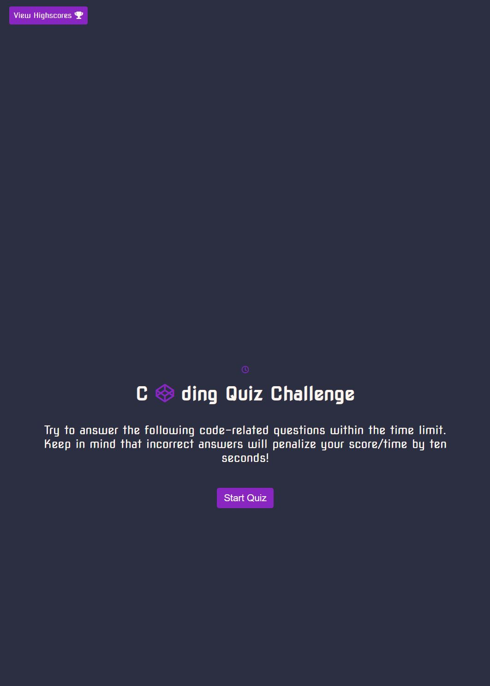
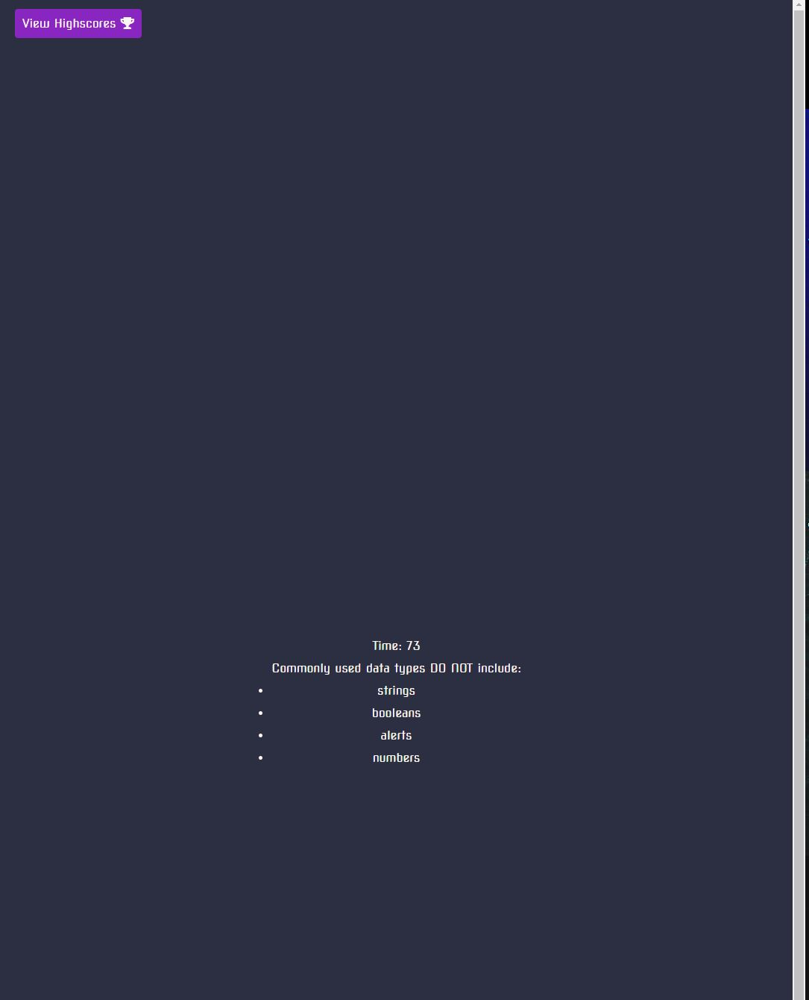
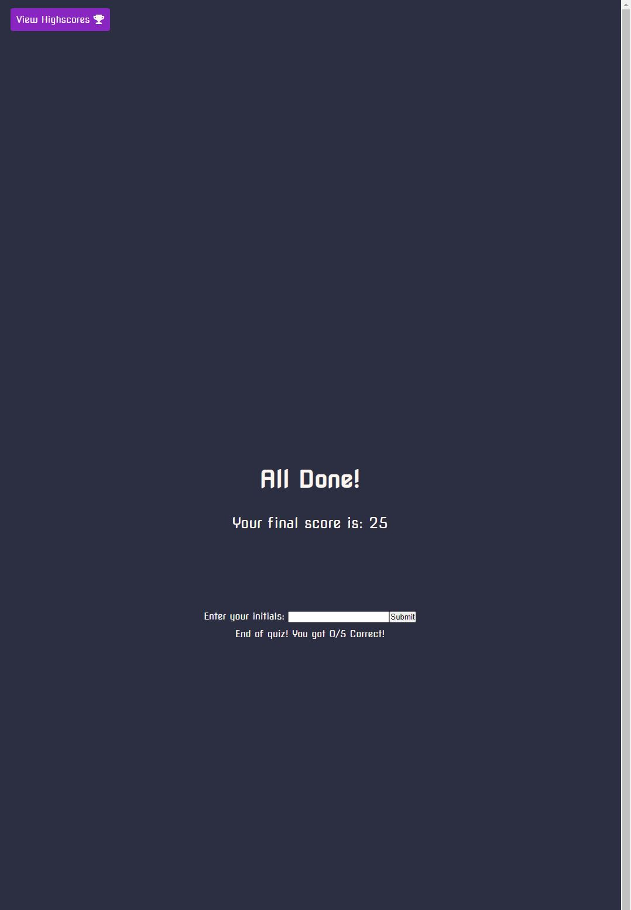
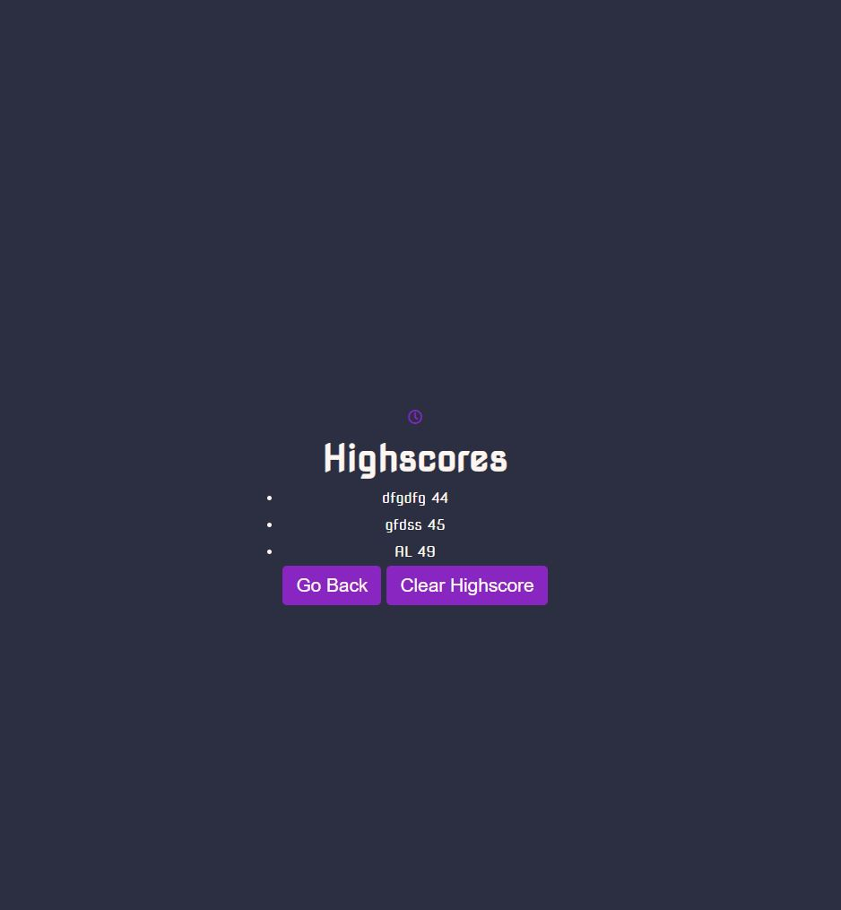

# code-quiz-lohith-amal

  
# CODE QUIZ 

##INSTALLATION
1. dowload/clone repository
2. open index.html
3.user a text editor ti run application.

## WORKING
1. click "start quiz"
2. read question and click to the option
3. if wrong answer clicked, time will be ruduced by  10 seconds.  
4. when quiz completed you can enter your intial and view your Highscore.
## APPLICATION HOME PAGE

## QUIZ BEGIN COUNTER STARTS

## ENTER YOUR INTIALS AND SAVES SCORE

## VIEW SCORES

## TECHNOLOGIES
### HTML
### CSS
### JAVASCRIPT

## REFRENCE AND ACKNOWLEDGEMENT
### CODE IDEAS AND FUNCTIONALITY REFERENCE FROM :

https://github.com/jamierachael/Code-Quiz

https://www.youtube.com/watch?v=f4fB9Xg2JEY&t=2742s

https://github.com/TiffanyCasey/Code-Quiz/blob/master/script.js

https://github.com/jamesqquick/Build-A-Quiz-App-With-HTML-CSS-and-JavaScript

## GITHUB repository
https://github.com/LohithAmal/code-quiz-lohith-amal

##LIVE DEPLYOMENT
https://lohithamal.github.io/code-quiz-lohith-amal/

